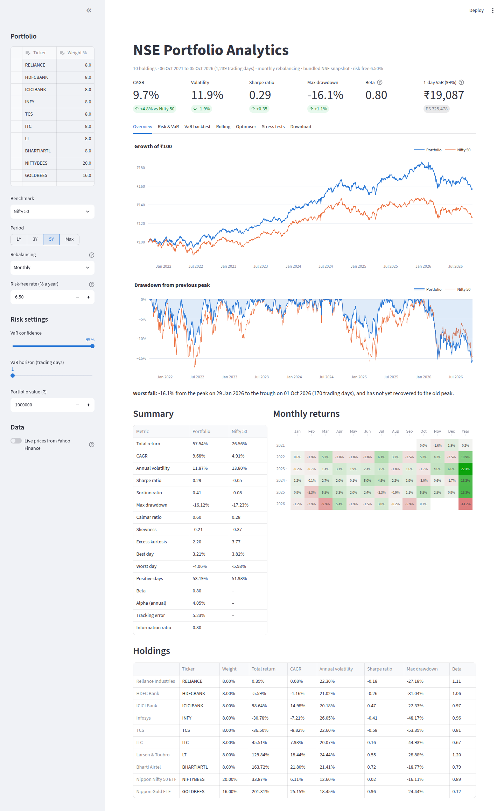
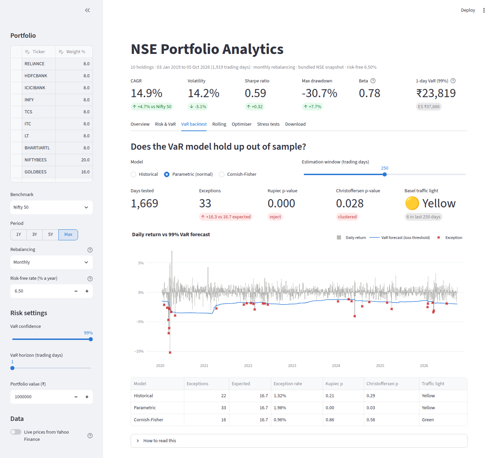
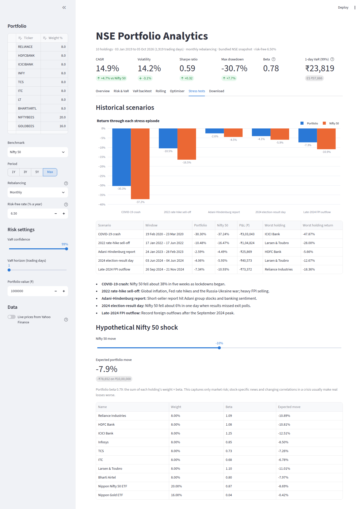
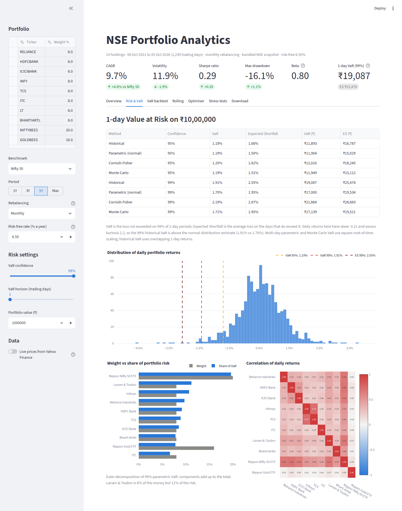
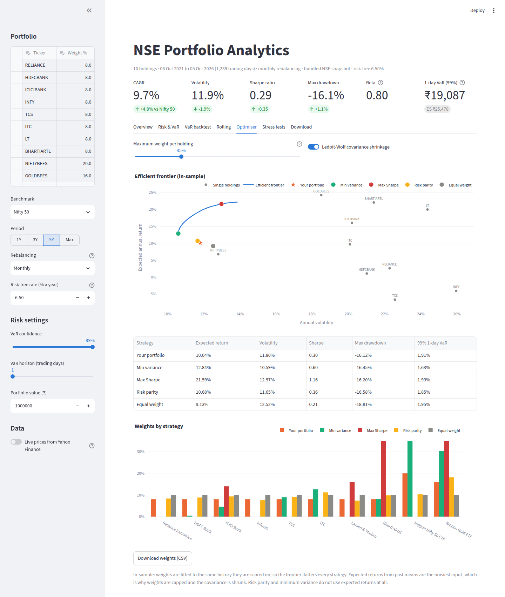

# NSE Portfolio Analytics

Performance and risk analytics for a basket of NSE stocks and ETFs, built in Python with a Streamlit dashboard.
It measures returns, volatility, Sharpe and Sortino ratios, drawdowns, beta and alpha, estimates Value at Risk four
ways, backtests those VaR models with the tests regulators use, and optimises and stress-tests the portfolio.

> Real NSE prices (dividend- and split-adjusted) for 2019 onwards are bundled in `data/nse_prices.csv` and refreshed
> monthly by a GitHub Action, so the dashboard works offline. Live Yahoo Finance prices are one toggle away.



## Key results

Default basket: eight Nifty 50 large caps at 8% each, Nippon Nifty 50 ETF (NIFTYBEES) 20% and Nippon Gold ETF
(GOLDBEES) 16%, rebalanced monthly, risk-free rate 6.5%. Data as of 5 Oct 2026.

| | Jan 2019 – Oct 2026 | | Oct 2021 – Oct 2026 | |
| --- | --- | --- | --- | --- |
| | **Portfolio** | **Nifty 50** | **Portfolio** | **Nifty 50** |
| CAGR | 14.9% | 10.2% | 9.7% | 4.9% |
| Annual volatility | 14.2% | 17.3% | 11.9% | 13.8% |
| Sharpe ratio | 0.59 | 0.27 | 0.29 | −0.05 |
| Max drawdown | −30.7% | −38.4% | −16.1% | −17.2% |
| Beta | 0.78 | 1 | 0.80 | 1 |
| 1-day 99% historical VaR | 2.38% | | 1.91% | |

- **Normal VaR fails its backtest.** Over 1,669 out-of-sample days, 99% parametric VaR was breached 33 times against
  16.7 expected: Kupiec rejects it (p < 0.001) and the breaches cluster (Christoffersen p = 0.03), mostly in the
  March 2020 crash. Historical VaR (22 breaches, p = 0.21) and Cornish-Fisher VaR (16, p = 0.86) pass.
- **Fat tails.** Full-period daily returns have excess kurtosis of 16, so the normal distribution understates the
  99% loss (2.02% vs 2.38% historical).
- **Gold is the diversifier.** GOLDBEES has a correlation of about 0.05 with the equities. Over the full period it is
  16% of the money but under 5% of the portfolio's VaR, while Larsen & Toubro carries about 11% of the risk on an
  8% weight.
- **Stress tests.** Through the COVID crash the portfolio fell 30.3% against 37.2% for the Nifty 50, and recovered
  its previous peak in 80 trading days.

The Nifty 50 here is the price index (Yahoo `^NSEI`), which excludes dividends of roughly 1.2–1.5% a year, while
stock and ETF prices are dividend-adjusted, so the comparison flatters the portfolio slightly. NIFTYBEES is the
total-return proxy inside the portfolio.

| VaR backtest | Stress tests |
| --- | --- |
|  |  |
| **Risk & VaR** | **Optimiser** |
|  |  |

## Run it

```bash
pip install -r requirements.txt
streamlit run app.py
pytest -q          # tests run on synthetic data, no network needed
```

## What it does

| Tab | Contents |
| --- | --- |
| **Overview** | Growth of ₹100 vs the Nifty 50, drawdown chart with peak, trough and recovery dates, summary metrics, per-holding statistics, monthly-returns heatmap |
| **Risk & VaR** | 1 to 21-day VaR and Expected Shortfall by four methods in % and ₹, return distribution, Euler risk contributions, correlation matrix |
| **VaR backtest** | Rolling out-of-sample VaR vs actual returns, exceptions, Kupiec and Christoffersen tests, Basel traffic light |
| **Rolling** | 3, 6 or 12-month rolling volatility, Sharpe ratio and beta |
| **Optimiser** | Efficient frontier with a weight cap, minimum-variance, maximum-Sharpe, risk-parity and equal-weight portfolios |
| **Stress tests** | Portfolio return through five real Indian market shocks, plus a beta-based "what if the Nifty falls X%" shock |
| **Download** | Excel risk report (8 sheets), prices and returns as CSV |

The sidebar sets the holdings and weights (any NSE symbol), benchmark (Nifty 50 or Nifty Bank), period,
rebalancing frequency (monthly, quarterly, yearly or buy-and-hold), risk-free rate, VaR confidence and horizon, and
portfolio value in ₹.

## Methods

**Returns.** Daily simple returns from adjusted closes, 252 trading days a year. Portfolio returns are computed by
growing each position within a holding period and resetting to target weights at each rebalance, so buy-and-hold
weights drift with prices as they would in a real account.

**Ratios.** Sharpe = mean daily excess return / its standard deviation × √252, with the 91-day T-bill yield as the
risk-free rate (6.5% by default). Sortino uses downside deviation only; Calmar is CAGR / |max drawdown|. Beta and
Jensen's alpha come from an OLS regression of excess returns on the benchmark's excess returns; tracking error and
the information ratio come from active returns.

**Value at Risk** (reported as a positive loss):

| Method | How | Weakness it addresses / has |
| --- | --- | --- |
| Historical | Empirical quantile of past (overlapping h-day) returns | Keeps fat tails; only knows what happened in the window |
| Parametric | μ + zσ under a normal distribution, √h scaling | Simple; understates tail risk when returns are fat-tailed |
| Cornish-Fisher | Normal quantile adjusted for observed skew and kurtosis | Captures fat tails analytically; unreliable at very high kurtosis |
| Monte Carlo | 50,000 correlated draws (Cholesky of the covariance) revalued through the weights | Extends to non-linear positions; inherits the normal assumption here |

Expected Shortfall is the average loss beyond VaR (the measure Basel's FRTB now uses for market risk capital).
Component VaR uses the Euler decomposition `w_i (Σw)_i / σ_p × z`, so the parts add up exactly to the total and show
which holdings carry more risk than their weight.

**VaR backtesting.** Each day's VaR is estimated from only the previous 250 days and compared with that day's return.
The **Kupiec** proportion-of-failures test checks whether the exception count matches the confidence level, the
**Christoffersen** test checks whether exceptions cluster, and the **Basel traffic light** classifies the last 250
days at 99% (0–4 exceptions green, 5–9 yellow, 10+ red).

**Optimisation.** Long-only SLSQP with a per-holding cap. The covariance matrix uses **Ledoit-Wolf shrinkage**, which
gives much more stable weights than the noisy sample covariance. Risk parity solves for equal risk contributions and,
like minimum variance, does not depend on expected returns, the noisiest input. All results are in-sample.

**Stress tests.** COVID-19 crash (Feb–Mar 2020), 2022 rate-hike sell-off, Adani-Hindenburg report (Jan–Feb 2023),
2024 election-result day, and the late-2024 FPI outflow, plus a hypothetical benchmark shock scaled by each
holding's beta.

## Project structure

```
app.py                       Streamlit dashboard
portfolio_analytics/
  data.py                    Yahoo Finance download, bundled snapshot, cleaning and alignment
  metrics.py                 returns, rebalancing, CAGR, Sharpe, Sortino, drawdown, CAPM, rolling, calendar
  risk.py                    VaR (4 methods), Expected Shortfall, component VaR, backtesting and tests
  optimize.py                Ledoit-Wolf covariance, min variance, max Sharpe, risk parity, frontier
  stress.py                  historical scenarios and beta shocks
  charts.py                  Plotly figures
  report.py                  Excel risk report
scripts/fetch_data.py        refreshes data/nse_prices.csv
tests/                       metric, VaR, backtest, optimiser and dashboard tests
.github/workflows/           CI and the monthly data refresh
```

## Limitations

- Historical and Monte Carlo VaR assume the past window is representative; volatility regimes change.
- Monte Carlo uses a multivariate normal; a Student-t or filtered historical simulation would capture tails better.
- Optimised weights are fitted and evaluated on the same data, so their statistics are optimistic.
- Yahoo Finance data has glitches. For example, it shows NIFTYBEES, BANKBEES and GOLDBEES at a tenth or a
  hundredth of their price on 19–20 Dec 2019; `remove_bad_ticks` blanks any quote more than 40% from its 11-day
  median and forward-fills it. Tickers with less than 90% coverage over the period are dropped and noted.

*For education and analysis only, not investment advice.*
